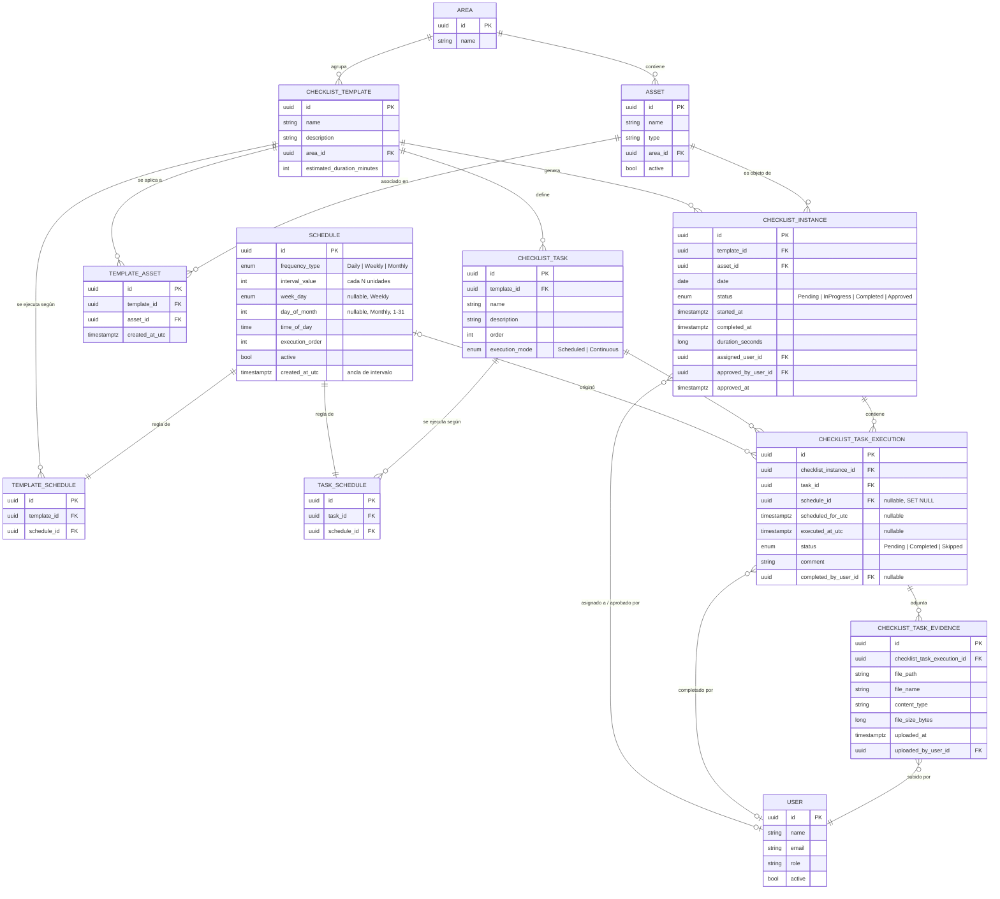

# Diagrama entidad-relación — Dominio de Checklists

Generado a partir del modelo de dominio tras el rediseño del sistema de recurrencia
(commit `ConvertToGenericSchedule`). Refleja el estado real de `HotelChecklist.Domain.Entities`
y las migraciones de PostgreSQL aplicadas.

## Idea central

Un `Schedule` es una regla de ejecución genérica (frecuencia + horario) que **no se comparte**:
cada fila de `TemplateSchedule` o `TaskSchedule` es dueña de su propio `Schedule`.

- `TemplateSchedule` decide **qué días** se genera una `ChecklistInstance` para un template.
- `TaskSchedule` decide **cuántas veces y a qué hora** se ejecuta una tarea dentro de esa
  instancia ya generada (una tarea `Scheduled` con 3 `TaskSchedule` produce 3
  `ChecklistTaskExecution` el mismo día; una tarea `Continuous` produce 1 sin horario).

## Diagrama

## Notas de diseño

- **Propiedad exclusiva de `Schedule`**: no hay tabla intermedia adicional ni reuso entre
  templates/tareas. Editar el set de horarios de un template o tarea borra y recrea sus filas de
  `Schedule` (mismo patrón "reemplazar el set completo" que ya usa
  `ConfigureTemplateAssetsHandler` para `TemplateAsset`).
- **Ancla de recurrencia**: `Schedule.created_at_utc` cumple el rol de fecha de inicio para
  calcular intervalos (`Weekly` cada N semanas, `Monthly` cada N meses) — no hay un campo de
  fecha de inicio explícito en el modelo, a propósito, para no duplicar semántica con
  `created_at_utc`.
- **`Schedule.schedule_id` en `ChecklistTaskExecution` es `SET NULL` al borrar la regla**: una
  ejecución ya registrada es un hecho histórico y no debe desaparecer ni bloquear el borrado de
  una regla de horario vieja.
- **Índice único** `(template_id, asset_id, date)` en `checklist_instances`: garantiza a nivel de
  base de datos lo que antes solo validaba la aplicación (`ChecklistInstanceCreationService`),
  cerrando una condición de carrera real en generaciones concurrentes.
- **`ScheduleEvaluationService`** (`Features/ChecklistInstances/ScheduleEvaluationService.cs`) es
  el único lugar que interpreta `Schedule` para decidir "¿corresponde hoy?" — tanto el generador
  (`GenerateScheduledChecklistsHandler`) como la proyección de próximas ejecuciones
  (`GetUpcomingOccurrencesHandler`) lo reutilizan sin duplicar la lógica de fechas.
