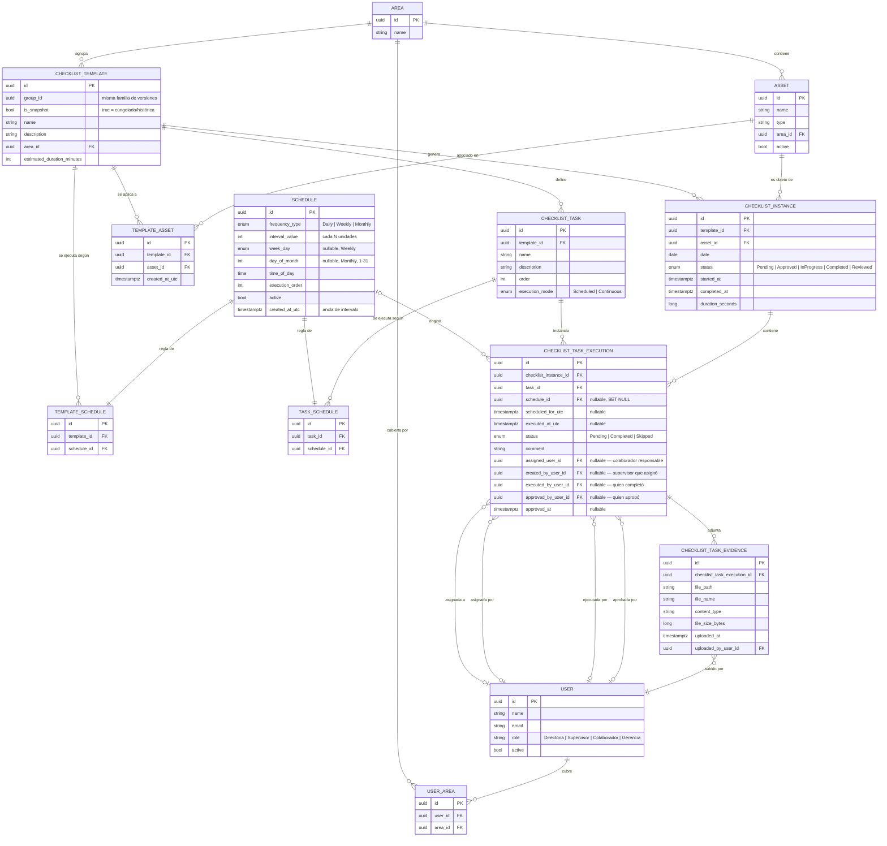

# Diagrama entidad-relación — Dominio de Checklists

Generado a partir del modelo de dominio tras el rediseño de asignación por tarea
(migración `AssignTasksToUsersAndUserAreas`). Refleja el estado real de
`HotelChecklist.Domain.Entities` y las migraciones de PostgreSQL aplicadas.

## Idea central

Un `Schedule` es una regla de ejecución genérica (frecuencia + horario) que **no se comparte**:
cada fila de `TemplateSchedule` o `TaskSchedule` es dueña de su propio `Schedule`.

- `TemplateSchedule` decide **qué días** se genera una `ChecklistInstance` para un template.
- `TaskSchedule` decide **cuántas veces y a qué hora** se ejecuta una tarea dentro de esa
  instancia ya generada (una tarea `Scheduled` con 3 `TaskSchedule` produce 3
  `ChecklistTaskExecution` el mismo día; una tarea `Continuous` produce 1 sin horario).

**La asignación de responsables vive a nivel de tarea, no de instancia.** `ChecklistInstance` no
tiene ningún campo ligado a `User`: es sólo la ejecución del template para un asset en una fecha.
Cada `ChecklistTaskExecution` lleva 4 relaciones independientes con `User`:

- `assigned_user_id` — el colaborador responsable de ejecutarla (lo define un Supervisor+).
- `created_by_user_id` — el Supervisor que hizo esa asignación.
- `executed_by_user_id` — quien efectivamente la completó (colaborador asignado o Supervisor+).
- `approved_by_user_id` / `approved_at` — quien la aprobó (al aprobar la instancia, se aprueban en
  bloque todas sus tareas `Completed`; al reabrir la instancia, se limpian ambos campos en cada
  tarea).

Los roles (`UserRole`) forman una jerarquía estrictamente aditiva, de menor a mayor:
`Colaborador ⊂ Supervisor ⊂ Gerencia ⊂ Directoria` — cada rol puede hacer todo lo que puede el
anterior, más lo suyo:

- **Colaborador**: completa sus propias tareas asignadas (`CompleteTask`); inicia/finaliza una
  instancia si tiene al menos una tarea asignada ahí.
- **Supervisor** (hereda lo de Colaborador, sin restringirse a "lo suyo"): asigna responsables
  por tarea (`AssignTask`, sólo dentro de las áreas que cubre vía `UserArea`), revisa checklists
  terminados (`Approve`), puede iniciar/finalizar/completar/reabrir **cualquier** instancia — no
  sólo la que tiene asignada. Lo único que un Supervisor **no** puede hacer es crear/eliminar
  templates o instancias.
- **Gerencia** (hereda todo lo de Supervisor): crea/edita/elimina `ChecklistTemplate`, configura
  sus assets, crea instancias manuales, dispara la generación programada
  (`GenerateScheduledChecklists`), elimina instancias.
- **Directoria** (hereda todo lo de Gerencia): administra usuarios (crear/editar/desactivar).

`Policies.SupervisorOrAbove` = Supervisor/Gerencia/Directoria; `Policies.ManagerOrAbove` =
Gerencia/Directoria — ambas listas de roles son subconjunto una de la otra, reflejando la
jerarquía aditiva de arriba.

Un `User` cubre cero o más `Area` a través de `UserArea` (many-to-many) — típicamente un
Supervisor cubre una o varias áreas, y ese vínculo es lo que acota qué instancias puede
listar/asignar (`ListChecklistInstancesHandler`, `AssignTaskHandler`) cuando el rol es
**exactamente** Supervisor (Gerencia/Directoria ven y asignan sin restricción de área).

## Estados de `ChecklistInstance`

El flujo tiene 5 estados, con dos transiciones automáticas (no accionadas por un botón):

1. **`Pending`** — recién creada (manual o por generación programada), sin responsables.
2. **`Approved`** *(automático)* — en cuanto la **última** `ChecklistTaskExecution` sin asignar
   recibe un responsable, la instancia pasa sola a `Approved` (`AssignTaskHandler`). Si luego se
   desasigna cualquier tarea mientras está en `Pending`/`Approved`, vuelve a `Pending` sola.
   Reasignar una tarea en una instancia ya `InProgress`/`Completed`/`Reviewed` no toca el status.
3. **`InProgress`** — al iniciar (`Start`), sólo permitido desde `Approved`.
4. **`Completed`** — al finalizar (`Finish`), exige que todas las tareas estén `Completed`.
5. **`Reviewed`** — revisión final de un Supervisor+ (`Approve`, deja `approved_by_user_id`/
   `approved_at` en cada `ChecklistTaskExecution` `Completed`). `Reopen` regresa desde
   `Completed`/`Reviewed` a `InProgress`, limpiando esos dos campos.

## Diagrama

## Notas de diseño

- **`ChecklistTemplate` versiona por copy-on-write en vez de mutar con historial**: `Update`
  separa los campos por si tocan o no `ChecklistTask`/`ChecklistTaskExecution` (FK `Restrict`):
  - **Nombre/descripción/área/duración/horarios del template**: nunca tocan `ChecklistTask`, así
    que siempre son seguros de mutar en el lugar (mismo `id`), sin importar si el template ya
    generó checklists, hoy o en el pasado.
  - **Lista de tareas** (agregar/quitar/renombrar tareas o sus horarios): si el template todavía
    no generó ninguna `ChecklistTaskExecution`, se reemplaza in situ igual que antes. En cuanto
    generó al menos una — de **cualquier fecha y cualquier status**, incluida una instancia de hoy
    en `Pending` — `Update` versiona siempre: congela la fila actual (`is_snapshot = true`, sin
    tocarle ni una tarea) y crea una fila nueva con el mismo `group_id`, `is_snapshot = false`, las
    tareas editadas y los `TemplateAsset` copiados. Las instancias/ejecuciones ya generadas no se
    tocan en absoluto y siguen apuntando a la fila congelada. Un mismo template puede así tener
    listas de tareas distintas según el momento en que se generó cada checklist — el mismo patrón
    que ya existía para `TemplateAsset`.

  `List`/`GenerateScheduledChecklists`/`GetUpcomingOccurrences` sólo consideran
  `is_snapshot = false`; `GetById` sobre un `id` congelado resuelve transparentemente a la versión
  viva del mismo `group_id`. `Delete` sobre un template con instancias propias "retira"
  (`is_snapshot = true`, sin sucesor) en vez de bloquear o borrar — deja de listarse/generar pero
  el histórico permanece íntegro.
- **`ChecklistInstance` no conoce usuarios**: nunca tuvo (ni tiene) un "responsable" único; la
  asignación siempre fue, es y será a nivel de `ChecklistTaskExecution`. `Start`/`Finish` de una
  instancia están permitidos para Supervisor+ o para cualquier colaborador que tenga al menos una
  `ChecklistTaskExecution` asignada en esa instancia (`instance.TaskExecutions.Any(e =>
  e.AssignedUserId == ActingUserId)`).
- **`CompleteTask` exige pertenencia**: sólo el colaborador en `AssignedUserId` de esa tarea
  específica, o un Supervisor+, pueden completarla — una tarea sin asignar sólo la completa
  Supervisor+.
- **`UserArea` acota qué puede ver/asignar un Supervisor exacto**: Gerencia y Directoria operan
  sin restricción de área; un usuario con rol exactamente `Supervisor` sólo ve (`List`) y asigna
  (`AssignTask`) instancias cuyo template pertenece a una de sus áreas en `UserArea`.
- **Crear/eliminar templates e instancias es exclusivo de Gerencia/Directoria**
  (`Policies.ManagerOrAbove`): `CreateChecklistTemplate`, `UpdateChecklistTemplate`,
  `DeleteChecklistTemplate`, `ConfigureTemplateAssets`, `CreateChecklistInstance`,
  `GenerateScheduledChecklists`, `DeleteChecklistInstance` y `ReopenChecklistInstance`. Un
  Supervisor puede ver, asignar, revisar e iniciar/finalizar cualquier instancia, pero no crear ni
  destruir templates o instancias — eso queda fuera de "lo que hereda" de Colaborador+Supervisor.
- **`CreateChecklistInstance` valida frecuencia** igual que la generación programada
  (`ScheduleEvaluationService.ShouldExecuteTemplate`): no se puede crear una instancia manual para
  una fecha que no coincide con la programación del template (p. ej. un template semanal de lunes
  no admite crear una instancia para un martes).
- **Propiedad exclusiva de `Schedule`**: no hay tabla intermedia adicional ni reuso entre
  templates/tareas. Editar el set de horarios de un template o tarea borra y recrea sus filas de
  `Schedule` (mismo patrón "reemplazar el set completo" que ya usa
  `ConfigureTemplateAssetsHandler` para `TemplateAsset`).
- **Ancla de recurrencia**: `Schedule.created_at_utc` cumple el rol de fecha de inicio para
  calcular intervalos (`Weekly` cada N semanas, `Monthly` cada N meses) — no hay un campo de
  fecha de inicio explícito en el modelo, a propósito, para no duplicar semántica con
  `created_at_utc`.
- **`Schedule.schedule_id` en `ChecklistTaskExecution` es `SET NULL` al borrar la regla**: una
  ejecución ya registrada es un hecho histórico y no debe desaparecer ni bloquear el borrado de
  una regla de horario vieja.
- **Índice único** `(template_id, asset_id, date)` en `checklist_instances`: garantiza a nivel de
  base de datos lo que antes solo validaba la aplicación (`ChecklistInstanceCreationService`),
  cerrando una condición de carrera real en generaciones concurrentes.
- **`ScheduleEvaluationService`** (`Features/ChecklistInstances/ScheduleEvaluationService.cs`) es
  el único lugar que interpreta `Schedule` para decidir "¿corresponde hoy?" — tanto el generador
  (`GenerateScheduledChecklistsHandler`) como la proyección de próximas ejecuciones
  (`GetUpcomingOccurrencesHandler`) lo reutilizan sin duplicar la lógica de fechas.
