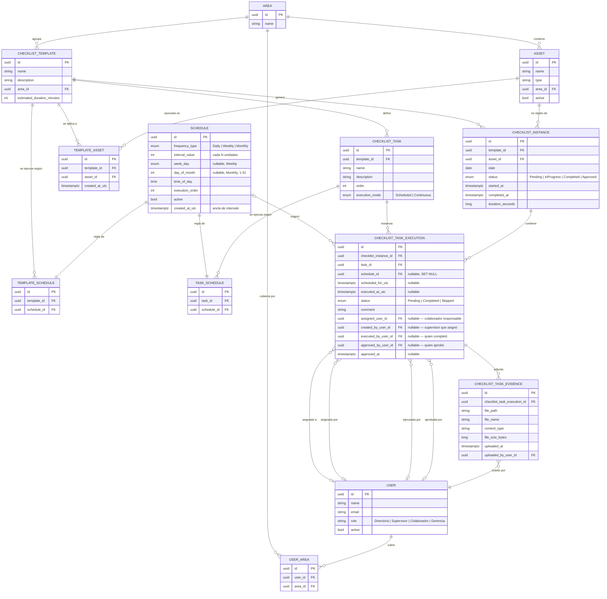

# Diagrama entidad-relación — Dominio de Checklists

Generado a partir del modelo de dominio tras el rediseño de asignación por tarea
(migración `AssignTasksToUsersAndUserAreas`). Refleja el estado real de
`HotelChecklist.Domain.Entities` y las migraciones de PostgreSQL aplicadas.

## Idea central

Un `Schedule` es una regla de ejecución genérica (frecuencia + horario) que **no se comparte**:
cada fila de `TemplateSchedule` o `TaskSchedule` es dueña de su propio `Schedule`.

- `TemplateSchedule` decide **qué días** se genera una `ChecklistInstance` para un template.
- `TaskSchedule` decide **cuántas veces y a qué hora** se ejecuta una tarea dentro de esa
  instancia ya generada (una tarea `Scheduled` con 3 `TaskSchedule` produce 3
  `ChecklistTaskExecution` el mismo día; una tarea `Continuous` produce 1 sin horario).

**La asignación de responsables vive a nivel de tarea, no de instancia.** `ChecklistInstance` no
tiene ningún campo ligado a `User`: es sólo la ejecución del template para un asset en una fecha.
Cada `ChecklistTaskExecution` lleva 4 relaciones independientes con `User`:

- `assigned_user_id` — el colaborador responsable de ejecutarla (lo define un Supervisor+).
- `created_by_user_id` — el Supervisor que hizo esa asignación.
- `executed_by_user_id` — quien efectivamente la completó (colaborador asignado o Supervisor+).
- `approved_by_user_id` / `approved_at` — quien la aprobó (al aprobar la instancia, se aprueban en
  bloque todas sus tareas `Completed`; al reabrir la instancia, se limpian ambos campos en cada
  tarea).

Los roles (`UserRole`) son, en orden jerárquico: `Directoria, Supervisor, Colaborador, Gerencia`
— Directoria y Gerencia tienen los mismos permisos que "Supervisor o superior" en todo el dominio
de checklists; la jerarquía de negocio real es Gerencia > Directoria > Supervisor > Colaborador,
pero a nivel de autorización sólo importa la distinción "Supervisor o superior" vs. "Colaborador".
Un `User` cubre cero o más `Area` a través de `UserArea` (many-to-many) — típicamente un
Supervisor cubre una o varias áreas, y ese vínculo es lo que acota qué instancias puede
listar/asignar (`ListChecklistInstancesHandler`, `AssignTaskHandler`) cuando el rol es
**exactamente** Supervisor (Gerencia/Directoria ven y asignan sin restricción de área).

## Diagrama

## Notas de diseño

- **`ChecklistInstance` no conoce usuarios**: nunca tuvo (ni tiene) un "responsable" único; la
  asignación siempre fue, es y será a nivel de `ChecklistTaskExecution`. `Start`/`Finish` de una
  instancia están permitidos para Supervisor+ o para cualquier colaborador que tenga al menos una
  `ChecklistTaskExecution` asignada en esa instancia (`instance.TaskExecutions.Any(e =>
  e.AssignedUserId == ActingUserId)`).
- **`CompleteTask` exige pertenencia**: sólo el colaborador en `AssignedUserId` de esa tarea
  específica, o un Supervisor+, pueden completarla — una tarea sin asignar sólo la completa
  Supervisor+.
- **`UserArea` acota qué puede ver/asignar un Supervisor exacto**: Gerencia y Directoria operan
  sin restricción de área; un usuario con rol exactamente `Supervisor` sólo ve (`List`) y asigna
  (`AssignTask`) instancias cuyo template pertenece a una de sus áreas en `UserArea`.
- **Propiedad exclusiva de `Schedule`**: no hay tabla intermedia adicional ni reuso entre
  templates/tareas. Editar el set de horarios de un template o tarea borra y recrea sus filas de
  `Schedule` (mismo patrón "reemplazar el set completo" que ya usa
  `ConfigureTemplateAssetsHandler` para `TemplateAsset`).
- **Ancla de recurrencia**: `Schedule.created_at_utc` cumple el rol de fecha de inicio para
  calcular intervalos (`Weekly` cada N semanas, `Monthly` cada N meses) — no hay un campo de
  fecha de inicio explícito en el modelo, a propósito, para no duplicar semántica con
  `created_at_utc`.
- **`Schedule.schedule_id` en `ChecklistTaskExecution` es `SET NULL` al borrar la regla**: una
  ejecución ya registrada es un hecho histórico y no debe desaparecer ni bloquear el borrado de
  una regla de horario vieja.
- **Índice único** `(template_id, asset_id, date)` en `checklist_instances`: garantiza a nivel de
  base de datos lo que antes solo validaba la aplicación (`ChecklistInstanceCreationService`),
  cerrando una condición de carrera real en generaciones concurrentes.
- **`ScheduleEvaluationService`** (`Features/ChecklistInstances/ScheduleEvaluationService.cs`) es
  el único lugar que interpreta `Schedule` para decidir "¿corresponde hoy?" — tanto el generador
  (`GenerateScheduledChecklistsHandler`) como la proyección de próximas ejecuciones
  (`GetUpcomingOccurrencesHandler`) lo reutilizan sin duplicar la lógica de fechas.
