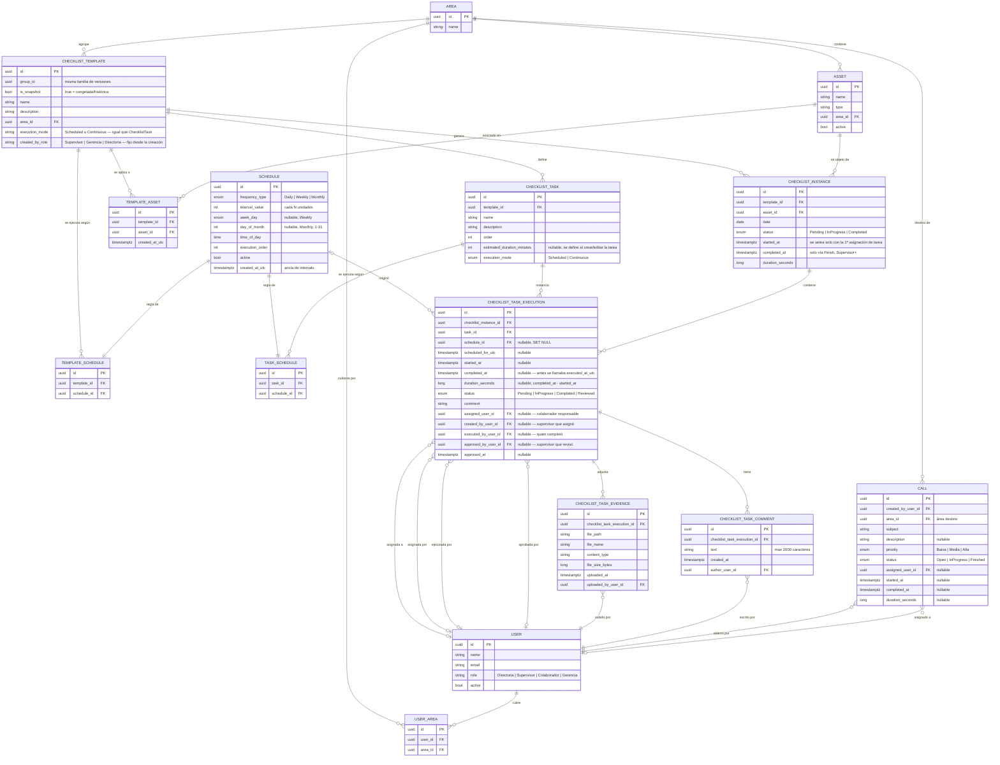

# Diagrama entidad-relación — Dominio de Checklists

Generado a partir del modelo de dominio tras el rediseño de asignación por tarea
(migración `AssignTasksToUsersAndUserAreas`). Refleja el estado real de
`HotelChecklist.Domain.Entities` y las migraciones de PostgreSQL aplicadas.

## Idea central

Un `Schedule` es una regla de ejecución genérica (frecuencia + horario) que **no se comparte**:
cada fila de `TemplateSchedule` o `TaskSchedule` es dueña de su propio `Schedule`.

- `TemplateSchedule` decide **qué días** se genera una `ChecklistInstance` para un template.
- `TaskSchedule` decide **cuántas veces y a qué hora** se ejecuta una tarea dentro de esa
  instancia ya generada (una tarea `Scheduled` con 3 `TaskSchedule` produce 3
  `ChecklistTaskExecution` el mismo día; una tarea `Continuous` produce 1 sin horario).

**La asignación de responsables vive a nivel de tarea, no de instancia.** `ChecklistInstance` no
tiene ningún campo ligado a `User`: es sólo la ejecución del template para un asset en una fecha.
Cada `ChecklistTaskExecution` lleva 4 relaciones independientes con `User`:

- `assigned_user_id` — el colaborador responsable de ejecutarla (lo define un Supervisor+).
- `created_by_user_id` — el Supervisor que hizo esa asignación.
- `executed_by_user_id` — quien efectivamente la completó (colaborador asignado o Supervisor+).
- `approved_by_user_id` / `approved_at` — quien la aprobó (al aprobar la instancia, se aprueban en
  bloque todas sus tareas `Completed`; al reabrir la instancia, se limpian ambos campos en cada
  tarea).

Los roles (`UserRole`) forman una jerarquía estrictamente aditiva, de menor a mayor:
`Colaborador ⊂ Supervisor ⊂ Gerencia ⊂ Directoria` — cada rol puede hacer todo lo que puede el
anterior, más lo suyo:

- **Colaborador**: completa sus propias tareas asignadas (`CompleteTask`); inicia/finaliza una
  instancia si tiene al menos una tarea asignada ahí.
- **Supervisor** (hereda lo de Colaborador, sin restringirse a "lo suyo"): asigna responsables
  por tarea (`AssignTask`, sólo dentro de las áreas que cubre vía `UserArea`), revisa checklists
  terminados (`Approve`), puede iniciar/finalizar/completar/reabrir **cualquier** instancia — no
  sólo la que tiene asignada. Lo único que un Supervisor **no** puede hacer es crear/eliminar
  templates o instancias.
- **Gerencia** (hereda todo lo de Supervisor): crea/edita/elimina `ChecklistTemplate`, configura
  sus assets, crea instancias manuales, dispara la generación programada
  (`GenerateScheduledChecklists`), elimina instancias.
- **Directoria** (hereda todo lo de Gerencia): administra usuarios (crear/editar/desactivar).

`Policies.SupervisorOrAbove` = Supervisor/Gerencia/Directoria; `Policies.ManagerOrAbove` =
Gerencia/Directoria — ambas listas de roles son subconjunto una de la otra, reflejando la
jerarquía aditiva de arriba.

Un `User` cubre cero o más `Area` a través de `UserArea` (many-to-many) — típicamente un
Supervisor cubre una o varias áreas, y ese vínculo es lo que acota qué instancias puede
listar/asignar (`ListChecklistInstancesHandler`, `AssignTaskHandler`) cuando el rol es
**exactamente** Supervisor (Gerencia/Directoria ven y asignan sin restricción de área).

## Estados de `ChecklistInstance`

El flujo tiene 5 estados, con dos transiciones automáticas (no accionadas por un botón):

1. **`Pending`** — recién creada (manual o por generación programada), sin responsables.
2. **`Approved`** *(automático)* — en cuanto la **última** `ChecklistTaskExecution` sin asignar
   recibe un responsable, la instancia pasa sola a `Approved` (`AssignTaskHandler`). Si luego se
   desasigna cualquier tarea mientras está en `Pending`/`Approved`, vuelve a `Pending` sola.
   Reasignar una tarea en una instancia ya `InProgress`/`Completed`/`Reviewed` no toca el status.
3. **`InProgress`** — al iniciar (`Start`), sólo permitido desde `Approved`.
4. **`Completed`** — al finalizar (`Finish`), exige que todas las tareas estén `Completed`.
5. **`Reviewed`** — revisión final de un Supervisor+ (`Approve`, deja `approved_by_user_id`/
   `approved_at` en cada `ChecklistTaskExecution` `Completed`). `Reopen` regresa desde
   `Completed`/`Reviewed` a `InProgress`, limpiando esos dos campos.

## Diagrama

## Notas de diseño

- **El ciclo de vida de `ChecklistInstance`/`ChecklistTaskExecution` se simplificó y se partió en
  dos niveles independientes**: la instancia ya no tiene `Approved` ni `Reviewed` — solo
  `Pending → InProgress → Completed` — y esos dos estados desaparecidos se movieron, en la forma
  de una revisión, al nivel de **cada tarea**: `Pending → InProgress → Completed → Reviewed`.
  - La instancia **nunca se "inicia" manualmente**: la primera vez que se asigna cualquiera de sus
    tareas (`AssignTask` con `UserId` no nulo mientras la instancia está `Pending`), pasa sola a
    `InProgress` y graba `started_at`. Desasignar no la hace retroceder.
  - Cada tarea tiene su propio ciclo operado por el colaborador asignado (o Supervisor+ en su
    lugar): `StartTask` (`Pending → InProgress`, graba `started_at`) y `CompleteTask`
    (`InProgress → Completed`, graba `completed_at` y `duration_seconds = completed_at -
    started_at`). Ya no existe el toggle "completar/descompletar" que tenía antes ni el estado
    `Skipped` — todas las tareas tienen que llegar a `Completed` (o `Reviewed`) para poder concluir
    el checklist, sin atajos.
  - **`ReviewTask` (`Completed → Reviewed`) es exclusivo de Supervisor+**, nunca del colaborador
    asignado — reusa las columnas `approved_by_user_id`/`approved_at` que antes se llenaban en
    bloque sobre todas las tareas al aprobar la instancia entera; ahora se llenan una tarea a la
    vez.
  - **`FinishChecklistInstance` (`InProgress → Completed`) es exclusivo de Supervisor+** (antes
    también lo podía hacer un colaborador con una tarea asignada) y exige que **ninguna** tarea
    esté en `Pending`/`InProgress` — `Completed` y `Reviewed` cuentan igual como "concluida".
  - **`ReopenChecklistInstance` (Supervisor+) vuelve todo al estado inicial de verdad**: la
    instancia a `Pending` sin `started_at`/`completed_at`/`duration_seconds`, y cada tarea pierde
    asignación, horarios, comentario, revisión **y sus evidencias subidas** (se borran los archivos
    del storage además de las filas) — no es un simple "retroceder un paso" como antes.
  - `ChecklistTask.EstimatedDurationMinutes` (opcional) se define al crear/editar la tarea dentro
    del template, no al asignarla ni en la lista de tareas de la instancia — `AssignTask` ya no
    recibe ni guarda una duración propia; `GetChecklistInstanceById` la proyecta desde
    `Task.EstimatedDurationMinutes` para mostrarla de solo lectura junto a cada ejecución.
    `ChecklistTemplate.EstimatedDurationMinutes` (duración del checklist completo) se eliminó por
    no ser necesaria: la duración ahora vive únicamente a nivel de cada tarea.
  - **`RestartTask`** (Supervisor+, `Completed`/`Reviewed` → `Pending`) permite reabrir una tarea
    puntual sin reabrir todo el checklist: limpia `started_at`/`completed_at`/`duration_seconds`,
    `executed_by_user_id` y la revisión (`approved_by_user_id`/`approved_at`), pero **conserva**
    `assigned_user_id`, `comment` y las evidencias — a diferencia de `ReopenChecklistInstance`, que
    limpia todo. Si el checklist ya estaba `Completed`, vuelve a `InProgress` y se le borran
    `completed_at`/`duration_seconds` (una tarea `Pending` no puede convivir con un checklist
    `Completed`, que exige todas las tareas concluidas/revisadas).
  - **`ChecklistTaskComment`**: historial de comentarios libres por tarea (no reemplaza al campo
    `Comment` de `ChecklistTaskExecution`, que es una nota puntual asociada a la ejecución
    concreta) — cualquier usuario autenticado puede listarlos o agregar uno nuevo vía
    `POST/GET .../tasks/{id}/comments`, sin restricción de asignación ni de estado de la tarea.
    `GetChecklistInstanceById` expone `CommentCount` por tarea, igual que `EvidenceCount`.
  - `DashboardResponse` suma estadísticas por **tarea** (`TasksTotal/Pending/InProgress/Completed/
    Reviewed/Overdue`, `AverageTaskDurationSeconds`) además de las ya existentes por checklist —
    mismo filtro `FromDate`/`ToDate` sobre `ChecklistTaskExecution.ChecklistInstance.Date`.
  - Migración de datos existentes: `Approved→InProgress` y `Reviewed→Completed` a nivel instancia,
    `Skipped→Pending` a nivel tarea; la columna `executed_at_utc` (que ya guardaba la fecha de
    completado) se renombró a `completed_at` en vez de perder ese dato.
- **`ChecklistTemplate.CreatedByRole` impone jerarquía de edición, `ChecklistInstance` no**: cada
  template graba el rol de quien lo creó (fijo desde la creación, no se recalcula si ese usuario
  cambia de rol después). `Update`, `Delete` y `ConfigureAssets` rechazan con 403
  (`ChecklistTemplates.InsufficientHierarchy`) si `RoleHierarchy.Rank(usuario actuante) <
  RoleHierarchy.Rank(created_by_role)` — jerarquía `Directoria(3) > Gerencia(2) > Supervisor(1) >
  Colaborador(0)`. `Create` no tiene restricción (cualquier Supervisor+), graba su propio rol.
  Cuando el versionado copy-on-write crea una fila nueva (edición que cambia tareas), esa fila
  nueva queda marcada con el rol de quien hizo la edición — sólo puede llegar a esa rama alguien
  con jerarquía suficiente para editar el original, así que esto no abre ningún agujero. Los
  templates que ya existían antes de esta feature quedaron con `created_by_role = Supervisor`
  (backfill de migración), para no dejar a ningún Supervisor actual sin acceso a lo que ya había.
  **`ChecklistInstance` no tiene ningún campo ni restricción equivalente**: Supervisor+ puede
  crear (manual o por frecuencia), asignar colaborador, iniciar/finalizar/aprobar/reabrir/borrar
  cualquier instancia sin importar de qué rol es el template de origen — la jerarquía sólo protege
  el template en sí, nunca los checklists que genera.
- **`Call` (chamados) es un flujo independiente de los checklists**, con su propio ciclo de vida
  de 3 estados: `Open → InProgress → Finished` (sin reabrir, sin editar ni borrar después de
  creado — se puede agregar si hace falta). Solo Supervisor+ puede abrir uno (`CreateCall`).
  Visibilidad de `List`:
  - Gerência/Diretoria: ven todos los chamados, sin restricción.
  - Supervisor (rol exacto): ve todos los chamados de sus áreas (`UserArea`), asignados o no.
  - Colaborador (rol exacto): ve los chamados asignados a él, más los **sin asignar** de sus
    áreas — en cuanto un chamado se asigna a alguien, deja de aparecer para el resto de los
    colaboradores de esa área (solo lo sigue viendo el asignado y Supervisor+). Esto es lo que
    hace que `UserArea` en un `Colaborador` (habilitado para cualquier rol, no solo Supervisor)
    tenga ahora un efecto funcional real.
  - `AssignCall` refleja la misma asimetría: un colaborador solo puede auto-asignarse un chamado
    sin asignar de un área que cubre (`Calls.CannotAssignOthers` si intenta asignar a otro,
    `Calls.AlreadyAssigned` si ya tiene dueño); Supervisor exacto debe cubrir el área del chamado
    pero puede asignarlo a cualquier usuario activo; Gerência/Diretoria no tienen restricción.
  - `Start`/`Finish` siguen el mismo criterio que `ChecklistInstance`: el usuario asignado o
    Supervisor+.
  - `Priority` (`Baixa`/`Media`/`Alta`) se persiste como string (`HasConversion<string>()`) por
    legibilidad en la base, así que `List` NO puede ordenar con `OrderByDescending(c => c.Priority)`
    directo — eso ordena alfabéticamente la columna ("Alta" < "Baixa" < "Media"), no por urgencia.
    Se ordena con una expresión `Alta→2 | Media→1 | Baixa→0` que EF traduce a un `CASE` en SQL,
    y como desempate `ThenBy(CreatedAtUtc)` (más antiguo primero, FIFO dentro de la misma
    prioridad).
- **`ChecklistTemplate` versiona por copy-on-write en vez de mutar con historial**: `Update`
  separa los campos por si tocan o no `ChecklistTask`/`ChecklistTaskExecution` (FK `Restrict`):
  - **Nombre/descripción/área/duración/horarios del template**: nunca tocan `ChecklistTask`, así
    que siempre son seguros de mutar en el lugar (mismo `id`), sin importar si el template ya
    generó checklists, hoy o en el pasado.
  - **Lista de tareas** (agregar/quitar/renombrar tareas o sus horarios): si el template todavía
    no generó ninguna `ChecklistTaskExecution`, se reemplaza in situ igual que antes. En cuanto
    generó al menos una — de **cualquier fecha y cualquier status**, incluida una instancia de hoy
    en `Pending` — `Update` versiona siempre: congela la fila actual (`is_snapshot = true`, sin
    tocarle ni una tarea) y crea una fila nueva con el mismo `group_id`, `is_snapshot = false`, las
    tareas editadas y los `TemplateAsset` copiados. Las instancias/ejecuciones ya generadas no se
    tocan en absoluto y siguen apuntando a la fila congelada. Un mismo template puede así tener
    listas de tareas distintas según el momento en que se generó cada checklist — el mismo patrón
    que ya existía para `TemplateAsset`.

  `List`/`GenerateScheduledChecklists`/`GetUpcomingOccurrences` sólo consideran
  `is_snapshot = false`; `GetById` sobre un `id` congelado resuelve transparentemente a la versión
  viva del mismo `group_id`. `Delete` sobre un template con instancias propias "retira"
  (`is_snapshot = true`, sin sucesor) en vez de bloquear o borrar — deja de listarse/generar pero
  el histórico permanece íntegro.
- **`ChecklistTemplate.ExecutionMode` espeja `ChecklistTask.ExecutionMode` con la misma paridad
  total**: un template `Scheduled` requiere al menos un `TemplateSchedule` (igual que hoy); uno
  `Continuous` no debe tener ninguno — el validador rechaza ambas combinaciones cruzadas, igual que
  `ChecklistTaskRequestValidator` ya hacía para las tareas. `ScheduleEvaluationService
  .ShouldExecuteTemplate` trata un template `Continuous` como "genera todos los días desde su
  creación" (`date >= template.CreatedAtUtc`), sin depender de ningún `TemplateSchedule` — el
  frontend oculta por completo el editor de horarios cuando se elige Contínuo, exactamente como ya
  hacía para las tareas.
- **`ChecklistInstance` no conoce usuarios**: nunca tuvo (ni tiene) un "responsable" único; la
  asignación siempre fue, es y será a nivel de `ChecklistTaskExecution`. `Start`/`Finish` de una
  instancia están permitidos para Supervisor+ o para cualquier colaborador que tenga al menos una
  `ChecklistTaskExecution` asignada en esa instancia (`instance.TaskExecutions.Any(e =>
  e.AssignedUserId == ActingUserId)`).
- **`CompleteTask` exige pertenencia**: sólo el colaborador en `AssignedUserId` de esa tarea
  específica, o un Supervisor+, pueden completarla — una tarea sin asignar sólo la completa
  Supervisor+.
- **`UserArea` acota qué puede ver/asignar un Supervisor exacto**: Gerencia y Directoria operan
  sin restricción de área; un usuario con rol exactamente `Supervisor` sólo ve (`List`) y asigna
  (`AssignTask`) instancias cuyo template pertenece a una de sus áreas en `UserArea`.
- **Crear/eliminar templates e instancias es exclusivo de Gerencia/Directoria**
  (`Policies.ManagerOrAbove`): `CreateChecklistTemplate`, `UpdateChecklistTemplate`,
  `DeleteChecklistTemplate`, `ConfigureTemplateAssets`, `CreateChecklistInstance`,
  `GenerateScheduledChecklists`, `DeleteChecklistInstance` y `ReopenChecklistInstance`. Un
  Supervisor puede ver, asignar, revisar e iniciar/finalizar cualquier instancia, pero no crear ni
  destruir templates o instancias — eso queda fuera de "lo que hereda" de Colaborador+Supervisor.
- **`CreateChecklistInstance` valida frecuencia** igual que la generación programada
  (`ScheduleEvaluationService.ShouldExecuteTemplate`): no se puede crear una instancia manual para
  una fecha que no coincide con la programación del template (p. ej. un template semanal de lunes
  no admite crear una instancia para un martes).
- **Propiedad exclusiva de `Schedule`**: no hay tabla intermedia adicional ni reuso entre
  templates/tareas. Editar el set de horarios de un template o tarea borra y recrea sus filas de
  `Schedule` (mismo patrón "reemplazar el set completo" que ya usa
  `ConfigureTemplateAssetsHandler` para `TemplateAsset`).
- **Ancla de recurrencia**: `Schedule.created_at_utc` cumple el rol de fecha de inicio para
  calcular intervalos (`Weekly` cada N semanas, `Monthly` cada N meses) — no hay un campo de
  fecha de inicio explícito en el modelo, a propósito, para no duplicar semántica con
  `created_at_utc`.
- **`Schedule.schedule_id` en `ChecklistTaskExecution` es `SET NULL` al borrar la regla**: una
  ejecución ya registrada es un hecho histórico y no debe desaparecer ni bloquear el borrado de
  una regla de horario vieja.
- **Índice único** `(template_id, asset_id, date)` en `checklist_instances`: garantiza a nivel de
  base de datos lo que antes solo validaba la aplicación (`ChecklistInstanceCreationService`),
  cerrando una condición de carrera real en generaciones concurrentes.
- **`ScheduleEvaluationService`** (`Features/ChecklistInstances/ScheduleEvaluationService.cs`) es
  el único lugar que interpreta `Schedule` para decidir "¿corresponde hoy?" — tanto el generador
  (`GenerateScheduledChecklistsHandler`) como la proyección de próximas ejecuciones
  (`GetUpcomingOccurrencesHandler`) lo reutilizan sin duplicar la lógica de fechas.
